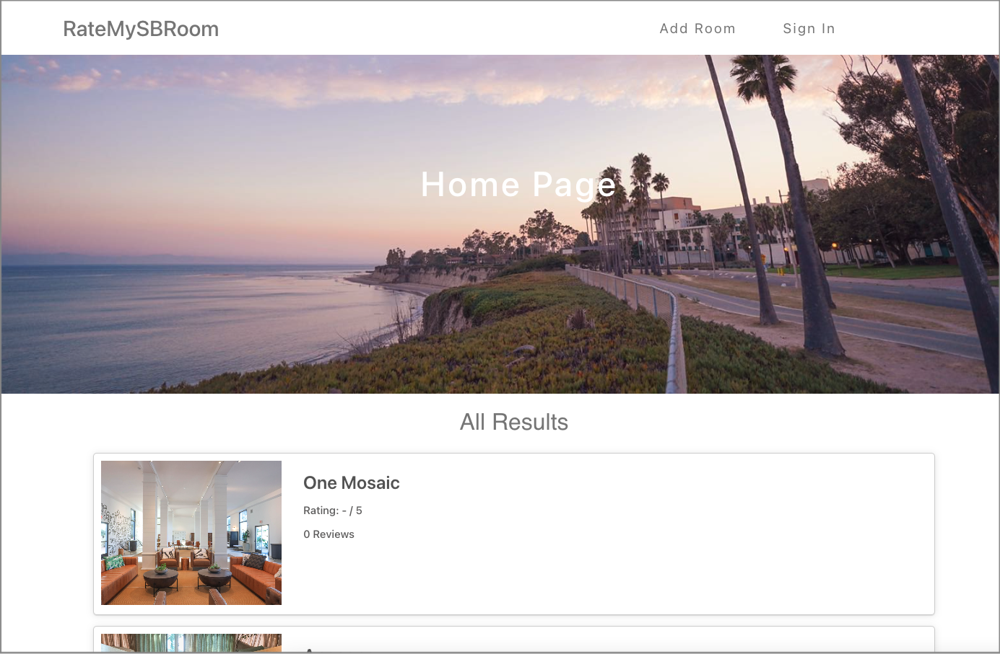

<!-- PROJECT LOGO -->
 

  
  <h3 align="center">RateMySBRoom</h3>

   

     A website designed for UCSB students to share their thoughts and experiences with university-housing as well as apartments in Isla Vista. The dynamic frontend was built using React while the backend server utilizes an ExpressJS framework. This web app is hosted on Heroku and connected to a MongoDB database, where it stores and handles data provided by the users. The integration of Google OAuth helps with user authentication and signing in.
   

   
   

     
Check it out here: <a href="https://ratemysbroom.herokuapp.com/">ratemysbroom.herokuapp.com</a> 

   

   

  

### Built With

* ![React.js]
* ![Node.js]
* ![Express.js]
* ![Heroku]
* ![MongoDB]
* ![GoogleCloud]

<!-- MARKDOWN LINKS & IMAGES -->
[React.js]: https://img.shields.io/badge/React-20232A?style=for-the-badge&logo=react&logoColor=61DAFB
[Node.js]: https://img.shields.io/badge/Node.js-43853D?style=for-the-badge&logo=node.js&logoColor=white
[Express.js]: https://img.shields.io/badge/Express.js-404D59?style=for-the-badge
[Heroku]: https://img.shields.io/badge/Heroku-430098?style=for-the-badge&logo=heroku&logoColor=white
[MongoDB]: https://img.shields.io/badge/MongoDB-4EA94B?style=for-the-badge&logo=mongodb&logoColor=white
[GoogleCloud]: https://img.shields.io/badge/Google_Cloud-4285F4?style=for-the-badge&logo=google-cloud&logoColor=white
